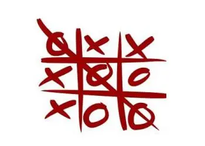
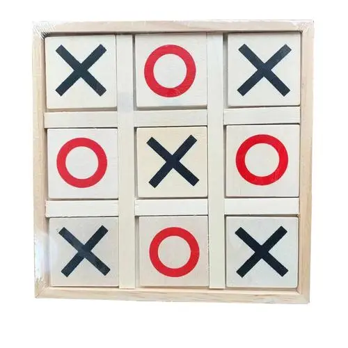
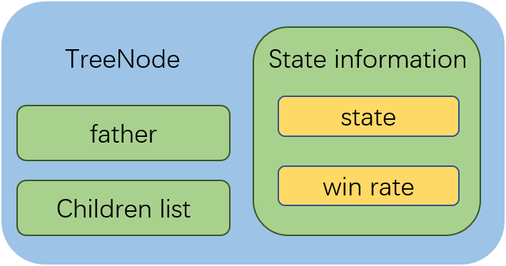
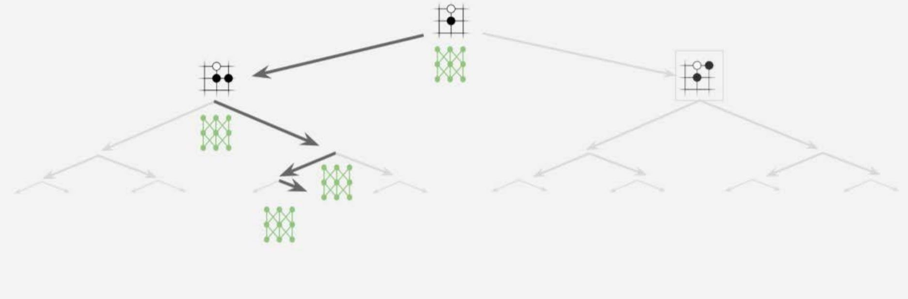

# TicTacToe game AI

## Introduction

This project is an implementation of monte carlo tree search on TicTacToe game. Via enough simulation, we draw to the conclusion that if both two players of a TicTacToe game are smart enough, the game will wind up with a draw with full certainty. The following parts of this document illustrate how this project implement a TicTacToe game and how to accomplish monte carlo tree search. Additional work such as $$\alpha$$-$$\beta$$ pruning will be done in a foreseeable future. To some extent this work may probably lay a foundation for AI based on Monte-Carlo method on more complicated games including Chinese Chess and Board Game Go.

## Game settings

The class TicTacToe maintains a TicTacToe game, serving functions of showing chessboard, making moves and judging whether the game end. If one player makes 3 pieces in a row (or column, diagonal), he/she will win the game.

After 9 game rounds, if no one wins the game and no place is available to drop a piece, the game will end up with a draw.

## Monte Carlo tree search

To start with, a Mone Carlo tree should be built. Each tree node comprises 4 parts: its father node id, its children's list, its game state and its winning rate.

In Monte Carlo tree search, each agent will complete enough episodes (e.g. 3000 episodes default) to find the best solution. In every episode, firstly reset all the game settings to input state. Then two players, 1 and -1, play the game in turn. For example, first player 1 choose an action by epsilon-greedy method, changing the game state. Then judge whether the game ends. If not reaching the end, the other player -1 will also take an action by epsilon-greedy--one difference, player -1's greedy means to minimize player 1's winning rate. After a whole game ends, retrieve the Mont Carlo tree all the way back to its root, updating the winning rate on each node. A victory is 2/2, a draw is 1/2, and a lose is 0/2.

After thousands of episodes of Monte Carlo simulation, choose the child of the root with the best winning rate and return it as action output. Each player takes action via this Monte Carlo simulation. You can see more implement details in codes.

## Further work

1. To this TicTacToe game, I will try some other algorithms to simplify this problem and accelerate this program, such as $$\alpha$$-$$\beta$$ pruning.
2. To migrate this project to other tasks like Board Game Go and Chinese Chess, I'll try to fit in some deep neural networks as policy function and design more complicated models based on this work.